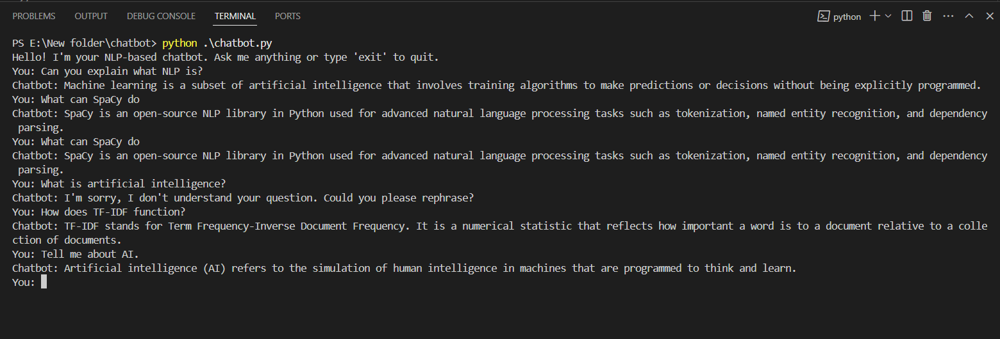

# NLP Chatbot with Semantic Understanding

## Developer Information
**Name**: Tejas Padaki  
**Company**: CODTECH IT SOLUTIONS  
**ID**: CT08EFO  
**Domain**: Python Programming  
**Duration**: 17th Dec to 17th Jan  

---

## Overview of the Project
**TASK**: Building an NLP-based chatbot capable of responding to user queries dynamically, without relying on predefined intents or static responses. The chatbot leverages advanced natural language processing techniques and machine learning models for understanding and generating responses.

---

## Objective
To develop a chatbot that uses natural language processing (NLP) techniques to understand user queries and provide meaningful responses based on a semantic similarity measure.

---

## Key Activities
1. **Data Preparation**:
   - Designed a knowledge base of questions and answers for the chatbot.
   - Preprocessed the questions to improve semantic understanding.

2. **Natural Language Processing**:
   - Used SpaCy for lemmatization and tokenization to process user inputs and knowledge base queries.

3. **Similarity Measurement**:
   - Implemented a TF-IDF vectorizer to convert text into numerical vectors.
   - Calculated cosine similarity to find the most relevant response from the knowledge base.

4. **Response Generation**:
   - Integrated a threshold mechanism to ensure the chatbot responds appropriately or asks for clarification if the confidence level is low.

---

## Technologies Used
- **Programming Language**: Python  
- **Libraries**:  
  - [SpaCy](https://spacy.io/) for NLP preprocessing.  
  - [Scikit-learn](https://scikit-learn.org/) for vectorization (TF-IDF) and similarity computation.  
  - NumPy for numerical operations.

---

## Scope
This chatbot serves as a foundation for developing advanced conversational agents. It can be expanded with additional features such as:
- Dynamic knowledge base updates.
- Integration with external APIs.
- Support for multilingual queries.

---

## Advantages
- **Dynamic Understanding**: Responds to paraphrased queries, ensuring flexibility in interactions.  
- **Scalable Knowledge Base**: Easy to add new questions and responses.  
- **Open Source Libraries**: Leverages robust NLP and machine learning tools.

---

## Disadvantages
- **Limited Contextual Understanding**: Cannot handle multi-turn conversations effectively.  
- **Knowledge Base Dependency**: Restricted to the predefined questions and answers.  
- **Threshold Sensitivity**: May fail to provide accurate responses if the similarity threshold is not well-tuned.

---

## Key Insights
- Semantic similarity measures like TF-IDF combined with cosine similarity are effective for building knowledge-driven chatbots.  
- Proper preprocessing, including lemmatization and stop-word removal, significantly improves response accuracy.

---

## Future Improvements
1. **Contextual Conversations**:
   - Implement memory to handle multi-turn dialogs.
2. **Enhanced Knowledge Base**:
   - Integrate external sources like Wikipedia or APIs for dynamic responses.
3. **Improved Algorithms**:
   - Explore advanced models like BERT or GPT for deeper semantic understanding.
4. **Multilingual Support**:
   - Extend support to handle queries in multiple languages.

---

## Code Explanation
- **Knowledge Base**: Defined as a dictionary containing questions and their respective answers.
- **Preprocessing**: Used SpaCy for text lemmatization and stop-word removal.
- **Vectorization**: TF-IDF vectorizer converts text into feature vectors for similarity calculations.
- **Similarity Matching**: Cosine similarity determines the closest match between user input and knowledge base questions.
- **Chat Loop**: An interactive loop where users can ask queries and receive responses dynamically.

---

##OutPut

## Contact
For any questions or feedback, feel free to reach out to:

**Tejas Padaki**  
**Company**: CODTECH IT SOLUTIONS  
**Email**: [tejaspadaki33@gmail.com](mailto:tejaspadaki33@gmail.com)
